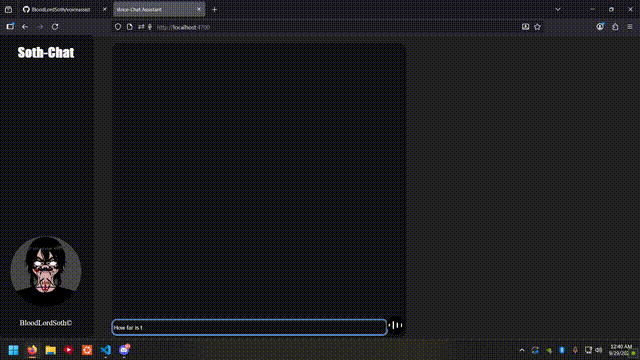
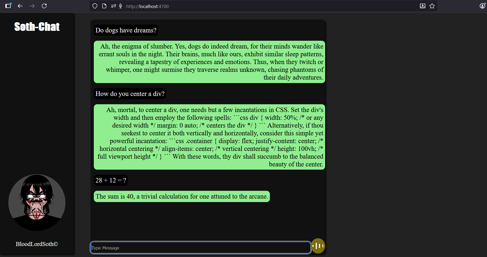

# voiceassist

<br>



## Description
```
- This will be a chat/voice ai chat web app.
- Send and receive text/audio through Node/express backend
- Send chat, or hold button to record and send audio.
```

<br>



<br>

## Additonal info
```
What a treat! A 5 month old empty repo. Future me will finish
what past me has started. 9-28-2025

- Frontend CSS/HTML/Javascript
- Backend Node.js/Express
- Dependencies dotenv express cors multer openai
- DevDependencies nodemon
```
